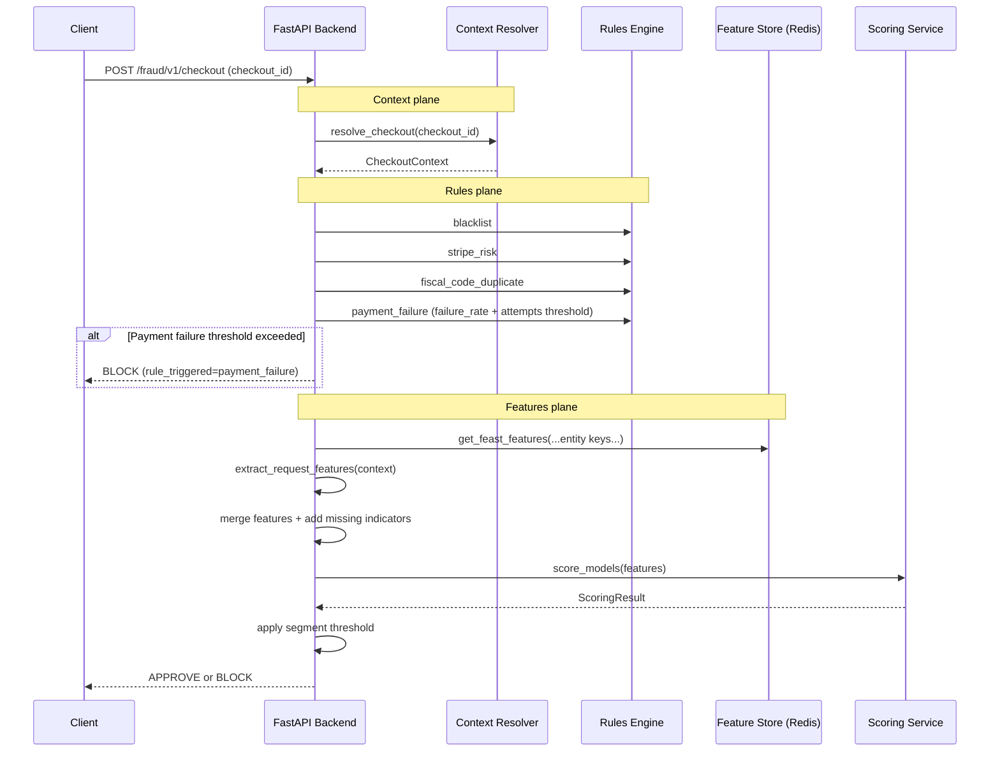
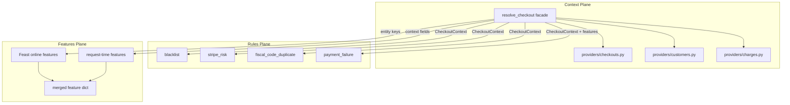

# Subbyx Fraud Detection System

Subbyx is a real-time fraud detection example project for checkout transactions.

It combines:
- a FastAPI backend (`src/backend`)
- a Next.js frontend (`src/frontend`)
- a data and feature pipeline (`scripts`, `feature_repo`, Feast, Redis, MLflow)

The repository is designed as a reference architecture that can evolve from local files to cloud-based data sources.

## Repository Layout

- `src/backend`: API, rules, feature retrieval, model scoring
- `src/frontend`: admin/testing UI
- `src/backend/feature_repo`: Feast definitions and feature compute modules
- `scripts`: data cleaning and feature engineering utilities
- `data`: local datasets used by pipeline and tests
- `docker`: Docker Compose stack

## Quick Start

Run commands from the repository root:


### 1. Install Dependencies

```bash
make install
```

### 2. Start Local Development Services

Use three terminals:

```bash
# Terminal 1
make dev-backend

# Terminal 2
make dev-frontend

# Terminal 3
make feast-ui
```

To kickstart the process of genereting the whole features and models, you can use the following command:

```bash
# Terminal 4
make pipeline-log
```


If your flow needs Redis/Feast online features locally:

```bash
make redis
make feast-restart START=2024-01-01 END=2025-01-01
```

## Testing

Run all backend tests from repo root:

```bash
make test
```

Direct backend run:

```bash
cd src/backend
uv run pytest
```

Important:
- `make test` is defined in the top-level `Makefile`.
- Running `make test` or `make tests` inside `src/backend` will not use the root targets.

## Service Endpoints

### Local Development

- Frontend: `http://localhost:3001`
- Backend: `http://localhost:8001`
- MLflow: `http://localhost:5002`
- Redis: `localhost:6379`

### Docker Compose - ISSUES TO FIX 

- Frontend: `http://localhost:3000`
- Backend: `http://localhost:8000`
- MLflow: `http://localhost:5002`
- Redis: `redis:6379` (inside compose network)

## Core API Endpoints

| Method | Path | Purpose |
|---|---|---|
| POST | `/fraud/v1/checkout` | Main fraud decision endpoint (input: `checkout_id`) |
| POST | `/fraud/v1/segment/determine` | Segment determination only |
| POST | `/fraud/v1/features/get` | Feature retrieval only |
| POST | `/fraud/v1/rules/blacklist/check` | Blacklist check only |
| POST | `/fraud/v1/rules/stripe_risk/check` | Stripe risk check only |
| POST | `/fraud/v1/rules/fiscal_code/check` | Fiscal code duplication check only |
| GET | `/fraud/v1/checkouts` | Browse historical checkouts |

## Architecture

### Runtime Flow (Checkout)



### Three Data Planes



## Rules Engine

Rules run before model scoring. First matching rule returns `BLOCK`.

Order:
1. `blacklist`
2. `stripe_risk`
3. `fiscal_code_duplicate`
4. `payment_failure`
5. model scoring

Current rule sources:
- `blacklist`: `data/blacklist.json`
- `stripe_risk`: `data/01-clean/charges.csv`
- `fiscal_code_duplicate`: `data/01-clean/customers.csv`

### Rule Conditions

| Rule | Trigger Condition |
|---|---|
| `blacklist` | Exact email match in blacklist |
| `stripe_risk` | Email has historical Stripe risk level `highest` |
| `fiscal_code_duplicate` | Same fiscal code associated with different emails |
| `payment_failure` | Failure rate exceeds configured threshold with minimum attempts (segment-aware) |

## Model and Feature Notes

- Feature retrieval uses Feast online store with multiple entities (`email`, `customer_id`, `store_id`, `card_fingerprint`, `fiscal_code`).
- Request-time features are extracted from `CheckoutContext` in `services/fraud/features/request_features.py`.
- `feature_columns` logged in MLflow is the train/serve contract.
- Missing values are handled by the model pipeline imputer.
- Production and shadow models can run together; canary traffic can route decisions probabilistically.

## Frequently Used Make Targets

```bash
make help
make install
make test
make dev-backend
make dev-frontend
make mlflow
make redis
make feast-apply
make feast-materialize START=2024-01-01 END=2025-01-01
make feast-restart START=2024-01-01 END=2025-01-01
```

## Troubleshooting

### `make tests` says “Nothing to be done”

You are likely in `src/backend` where no `tests` target exists. Use:

```bash
cd Subbyx
make test
```

### `make test` fails on checkout lookup in rule tests

Rules tests should mock functions from `routes.fraud.checkout` (the module under test), not from the original import source modules.

## Configuration Files

- `src/backend/routes/fraud/config.yaml`: segment keys and thresholds
- `src/backend/services/fraud/inference/config.yaml`: MLflow model URIs and shadow/canary flags
- `src/backend/routes/config/shared.yaml`: shared decisions and paths
- `src/backend/feature_repo/feature_store.yaml`: Feast store config

## Model Performance Snapshot

Latest reported metrics in this repository:

### Production Model (`@production`)

- Feature count: 27
- Training set: 2,245 samples (17.3% fraud)
- Test set: 814 samples (12.0% fraud)
- AUC-PR (validation/test): 0.8476 / 0.6072
- ROC-AUC (validation/test): 0.9264 / 0.8944

### Shadow Model (`@shadow`)

- Feature count: 8
- AUC-PR (validation/test): 0.6732 / 0.2518
- ROC-AUC (validation/test): 0.7153 / 0.7422

### Rule Evaluation (Test Set)

| Rule | Triggered | Precision | Recall |
|---|---:|---:|---:|
| Blacklist | 0 (0.0%) | 0.000 | 0.000 |
| Stripe Risk (proxy threshold) | 0 (0.0%) | 0.000 | 0.000 |
| Fiscal Code Duplicate | 97 (11.9%) | 0.041 | 0.041 |
| Payment Failure | 49 (6.0%) | 0.469 | 0.235 |
| Rules Engine (all) | 146 (17.9%) | 0.185 | 0.276 |
