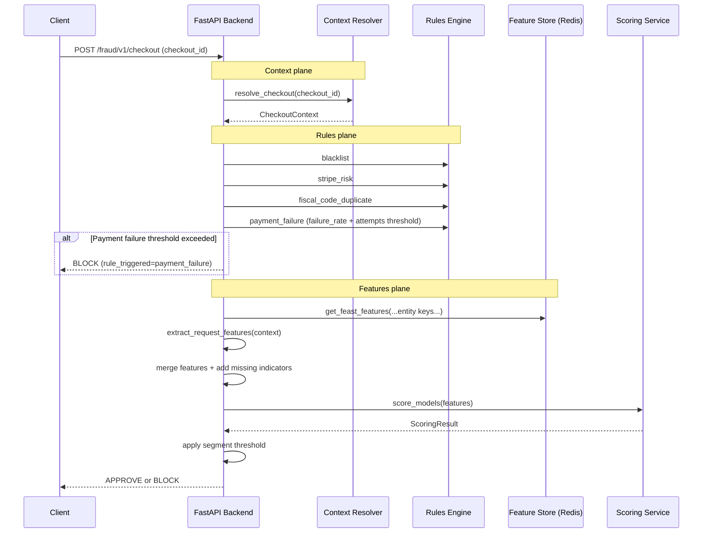
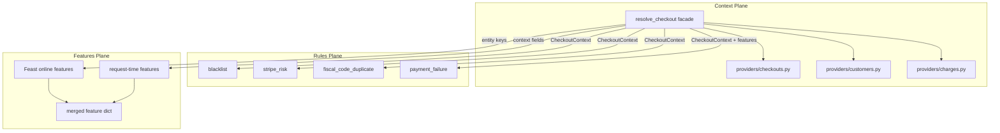

# Subbyx Fraud Detection System

Subbyx is a real-time fraud detection example project for checkout transactions.

It combines:
- a FastAPI backend (`src/backend`)
- a Next.js frontend (`src/frontend`)
- a data and feature pipeline (`scripts`, `feature_repo`, Feast, Redis, MLflow)

The repository is designed as a reference architecture that can evolve from local files to cloud-based data sources.

## Repository Layout

- `src/backend`: API, rules, feature retrieval, model scoring
- `src/frontend`: admin/testing UI
- `src/backend/feature_repo`: Feast definitions and feature compute modules
- `scripts`: data cleaning and feature engineering utilities
- `data`: local datasets used by pipeline and tests
- `docker`: Docker Compose stack

## Quick Start

Run commands from the repository root:


### 1. Install Dependencies

```bash
make install
```

### 2. Start Local Development Services

Use three terminals:

```bash
# Terminal 1
make dev-backend

# Terminal 2
make dev-frontend

# Terminal 3
make feast-ui
```

To kickstart the process of genereting the whole features and models, you can use the following command:

```bash
# Terminal 4
make pipeline-log
```


If your flow needs Redis/Feast online features locally:

```bash
make redis
make feast-restart START=2024-01-01 END=2025-01-01
```

## Testing

Run all backend tests from repo root:

```bash
make test
```

Direct backend run:

```bash
cd src/backend
uv run pytest
```

Important:
- `make test` is defined in the top-level `Makefile`.
- Running `make test` or `make tests` inside `src/backend` will not use the root targets.

## Service Endpoints

### Local Development

- Frontend: `http://localhost:3001`
- Backend: `http://localhost:8001`
- MLflow: `http://localhost:5002`
- Redis: `localhost:6379`

### Docker Compose - ISSUES TO FIX 

- Frontend: `http://localhost:3000`
- Backend: `http://localhost:8000`
- MLflow: `http://localhost:5002`
- Redis: `redis:6379` (inside compose network)

## Core API Endpoints

| Method | Path | Purpose |
|---|---|---|
| POST | `/fraud/v1/checkout` | Main fraud decision endpoint (input: `checkout_id`) |
| POST | `/fraud/v1/segment/determine` | Segment determination only |
| POST | `/fraud/v1/features/get` | Feature retrieval only |
| POST | `/fraud/v1/rules/blacklist/check` | Blacklist check only |
| POST | `/fraud/v1/rules/stripe_risk/check` | Stripe risk check only |
| POST | `/fraud/v1/rules/fiscal_code/check` | Fiscal code duplication check only |
| GET | `/fraud/v1/checkouts` | Browse historical checkouts |

## Architecture

### Runtime Flow (Checkout)



### Three Data Planes



## Rules Engine

Rules run before model scoring. First matching rule returns `BLOCK`.

Order:
1. `blacklist`
2. `stripe_risk`
3. `fiscal_code_duplicate`
4. `payment_failure`
5. model scoring

Current rule sources:
- `blacklist`: `data/blacklist.json`
- `stripe_risk`: `data/01-clean/charges.csv`
- `fiscal_code_duplicate`: `data/01-clean/customers.csv`

### Rule Conditions

| Rule | Trigger Condition |
|---|---|
| `blacklist` | Exact email match in blacklist |
| `stripe_risk` | Email has historical Stripe risk level `highest` |
| `fiscal_code_duplicate` | Same fiscal code associated with different emails |
| `payment_failure` | Failure rate exceeds configured threshold with minimum attempts (segment-aware) |

## Model and Feature Notes

- Feature retrieval uses Feast online store with multiple entities (`email`, `customer_id`, `store_id`, `card_fingerprint`, `fiscal_code`).
- Request-time features are extracted from `CheckoutContext` in `services/fraud/features/request_features.py`.
- `feature_columns` logged in MLflow is the train/serve contract.
- Missing values are handled by the model pipeline imputer.
- Production and shadow models can run together; canary traffic can route decisions probabilistically.

## Frequently Used Make Targets

```bash
make help
make install
make test
make dev-backend
make dev-frontend
make mlflow
make redis
make feast-apply
make feast-materialize START=2024-01-01 END=2025-01-01
make feast-restart START=2024-01-01 END=2025-01-01
```

## Troubleshooting

### `make tests` says “Nothing to be done”

You are likely in `src/backend` where no `tests` target exists. Use:

```bash
cd Subbyx
make test
```

### `make test` fails on checkout lookup in rule tests

Rules tests should mock functions from `routes.fraud.checkout` (the module under test), not from the original import source modules.

## Configuration Files

- `src/backend/routes/fraud/config.yaml`: segment keys and thresholds
- `src/backend/services/fraud/inference/config.yaml`: MLflow model URIs and shadow/canary flags
- `src/backend/routes/config/shared.yaml`: shared decisions and paths
- `src/backend/feature_repo/feature_store.yaml`: Feast store config

## Model Performance Snapshot

Latest reported metrics in this repository:

### Production Model (`@production`)

- Feature count: 27
- Training set: 2,245 samples (17.3% fraud)
- Test set: 814 samples (12.0% fraud)
- AUC-PR (validation/test): 0.8476 / 0.6072
- ROC-AUC (validation/test): 0.9264 / 0.8944

### Shadow Model (`@shadow`)

- Feature count: 8
- AUC-PR (validation/test): 0.6732 / 0.2518
- ROC-AUC (validation/test): 0.7153 / 0.7422

### Rule Evaluation (Test Set)

| Rule | Triggered | Precision | Recall |
|---|---:|---:|---:|
| Blacklist | 0 (0.0%) | 0.000 | 0.000 |
| Stripe Risk (proxy threshold) | 0 (0.0%) | 0.000 | 0.000 |
| Fiscal Code Duplicate | 97 (11.9%) | 0.041 | 0.041 |
| Payment Failure | 49 (6.0%) | 0.469 | 0.235 |
| Rules Engine (all) | 146 (17.9%) | 0.185 | 0.276 |


### Data Overview


## Table: checkouts

The checkout table represents **subscription requests** - the act of a customer requesting to subscribe to a device. It is NOT the monthly payment installments.

**Checkout modes:**
- `mode=setup` - Customer registration (dummy record, no device). Created when a customer account is created.
- `mode=payment` - **Real subscription request** (the actual subscription to a device). Contains device details like subscription_value, grade, category, sku, etc.
- `mode=subscription` - **Real subscription request**, equivalent to `mode=payment`.

**Important:** Only `mode=payment` and `mode=subscription` rows contain real subscription data. The `mode=setup` rows have no device information (subscription_value is empty).

**Customer journey:**
1. Customer starts registration → `mode=setup` (account created)
2. Customer subscribes to device → `mode=payment` or `mode=subscription` (real subscription - this is what we predict!)
3. Monthly installments → Tracked in `charges` and `payment_intents` tables

**Prediction:** Given a new subscription request (`mode=payment` or `mode=subscription`), will the customer end up in dunning (>15 days late on payments)?

| Column | Explanation | Notes |
|--------|--------------|-------|
| id | Checkout ID made by the customer | |
| created | Creation date | |
| status | Checkout status | `complete` = successful, `expired` = failed/abandoned |
| payment_intent | Associated payment intent | Only populated for `mode=payment`/`subscription` |
| mode | Checkout mode | `setup`=registration, `payment`=subscription request |
| customer | Associated customer ID | |
| subscription_value | Monthly installment amount | Only populated for `mode=payment`/`subscription` |
| grade | Device wear grade | Only for `mode=payment`/`subscription` |
| store_id | Store ID where the subscription was made | |
| sku | Model identifier | Only for `mode=payment`/`subscription` |
| has_linked_products | Presence of products associated with the main product | Associated products can be tablet pens, theft covers, or other types of covers |
| has_vetrino | Presence of screen protector | |
| has_protezione_totale | Presence of total protection warranty | |
| has_protezione_furto | Presence of theft coverage | |
| product_description | Product description | Only for `mode=payment`/`subscription` |
| category | Product category | Only for `mode=payment`/`subscription` |
| condition | Product condition | Only for `mode=payment`/`subscription` | |

---

## Table: payment_intents

A payment intent is created each time a payment is due from the customer. If an installment is not paid, multiple successive payment intents can be created for that same installment. Usually, a payment intent is created each day until the installment is paid.

| Column | Explanation | Notes |
|--------|--------------|-------|
| id | Payment intent ID | |
| amount | Payment amount due | |
| amount_received | Payment amount received | |
| canceled_at | Payment attempt cancellation date | |
| cancellation_reason | Cancellation reason | |
| created | Payment intent creation date | |
| customer | Associated customer ID | |
| latest_charge | Latest associated charge | |
| status | Payment status | |
| payment_error_code | Payment error code | |
| subscription_value | Installment value | The installment is calculated from the product value and is the same for all months of the year. An exception is only the second month of subscription. Indeed, the second installment equals the sum due to pay the product from the day payment is created to the 1st of the following month. For example, if a user subscribes on January 10 and the installment is 50 euros, they will pay 50 euros on January 12, 32.14 euros on February 12, and from then on 50 euros on the 1st of each subsequent month. |
| n_failures | Number of payment failures | |

---

## Table: charges

A charge is created each time a debit attempt is made. This attempt is made starting from a payment intent generated earlier. Each charge is associated with a customer and a payment intent.

| Column | Explanation | Notes |
|--------|--------------|-------|
| id | Charge ID | |
| created | Creation date | |
| customer | Associated customer ID | |
| failure_code | Failure code | |
| paid | Successful payment | |
| payment_intent | Associated payment intent ID | |
| status | Charge status | |
| email | Associated customer email | |
| is_recurrent | Indicates if the payment is recurring | If it is the first payment, i.e., the one made at the time of subscription, this value will be FALSE, otherwise TRUE |
| outcome_status | Charge outcome | |
| outcome_risk | Payment risk levels | These values come directly from the Stripe service we use to process payments |
| outcome_risk_level | | |
| outcome_risk_score | | |
| outcome_type | Outcome type based on result | |
| card_fingerprint | Used card ID | |
| card_brand | Card circuit | |
| card_funding | Card type | |
| card_issuer | Card issuer | |
| card_cvc_check | CVC code check | |

---

## Table: addresses

Addresses are created from the addresses entered by users during purchase.

| Column | Explanation | Notes |
|--------|--------------|-------|
| id | Anonymized address ID | |
| locality | Locality | |
| city | City | |
| state | Region | |
| administrative_area_level_1 | Main administrative area | |
| country | Country | |
| postal_code | Postal code | |

---

## Table: stores

Sellers are the physical and non-physical stores through which subscriptions are sold.

| Column | Explanation | Notes |
|--------|--------------|-------|
| name | Seller name | |
| store_id | Store ID | |
| partner_name | Partner name | |
| store_name | Store name | |
| address | Complete store address | |
| zip | Postal code | |
| state | Region | |
| province | Province | |
| area | Geographic area | |

---

## Business Notes

The goal is to create an anti-fraud system using the approach of your choice.

I recommend starting from the `customers` table, which contains the main user information. In particular, the `dunning_days` column indicates the delay in payments, the data we want to predict. Usually, we consider a user as a potential fraudster if the value exceeds 15 days, but you are free to choose the threshold you prefer.

The other tables can be linked to the `customers` table through the ID columns present in each table.


# Database Schema

## Overview

| Table | Rows | Primary Key | Foreign Keys |
|-------|------|-------------|--------------|
| customers | 3,634 | id | residential_address_id, shipping_address_id → addresses |
| checkouts | 6,384 | id | customer → customers, payment_intent → payment_intents |
| charges | 22,998 | id | customer → customers, payment_intent → payment_intents |
| payment_intents | 23,509 | id | customer → customers |
| addresses | 4,322 | id | (none) |
| stores | 115 | store_id | (none) |

---

## customers

| Column | Type | Description | Notes |
|--------|------|-------------|-------|
| id | UUID | Primary key | Unique customer identifier |
| email | String | Anonymized email | |
| created | Timestamp | Customer creation date | |
| fiscal_code | String | Anonymized fiscal code | Italian tax code |
| gender | String | Gender | |
| birth_date | Date | Birth date | Calculated from fiscal_code |
| birth_province | String | Birth province | |
| birth_country | String | Birth country | |
| birth_continent | String | Birth continent | |
| residential_address_id | UUID | Residential address FK | → addresses.id |
| shipping_address_id | UUID | Shipping address FK | → addresses.id |
| dunning_days | Float | Days since missed payment | **Target variable** (fraud > 15) |
| card_owner_names_card_owner_names_match_score | Float | Name similarity (card owners) | 0-1 |
| doc_name_email_match_score | Float | Name-email similarity (doc) | Expected 0-1, but data has outliers (max 875) - data quality issue |
| email_emails_match_score | Float | Email similarity (customer email vs any other email entered) | Expected 0-1, but data has outliers (max 875) - data quality issue |
| account_card_names_match_score | Float | Account-card name similarity | 0-1 |
| high_end_count | Integer | High-end devices purchased | |
| high_end_rate | Float | Ratio high-end/total devices | |

---

## checkouts

| Column | Type | Description | Notes |
|--------|------|-------------|-------|
| id | UUID | Primary key | |
| created | Timestamp | Checkout creation date | |
| status | String | Checkout status | expired, complete |
| payment_intent | UUID | Payment intent FK | → payment_intents.id |
| mode | String | Checkout mode | payment, setup, subscription |
| customer | UUID | Customer FK | → customers.id |
| subscription_value | Float | Monthly payment amount | |
| grade | String | Device condition | new, great, good |
| store_id | String | Store identifier | → stores.store_id |
| sku | String | Product SKU | |
| has_linked_products | Boolean | Has linked products | |
| has_vetrino | Boolean | Has screen protector | |
| has_protezione_totale | Boolean | Has total protection | |
| has_protezione_furto | Boolean | Has theft coverage | |
| product_description | String | Full product name | Contains embedded commas |
| category | String | Product category | smartphones, laptops, etc. |
| condition | String | Product condition | new, used |

---

## payment_intents

| Column | Type | Description | Notes |
|--------|------|-------------|-------|
| id | UUID | Primary key | |
| amount | Float | Payment amount due | |
| amount_received | Float | Payment amount received | |
| canceled_at | Timestamp | Cancellation date | |
| cancellation_reason | String | Cancellation reason | automatic |
| created | Timestamp | Creation date | |
| customer | UUID | Customer FK | → customers.id |
| latest_charge | UUID | Latest charge FK | → charges.id |
| status | String | Payment status | requires_payment_method, canceled |
| payment_error_code | String | Error code | |
| subscription_value | Float | Installment value | |
| n_failures | Integer | Number of failures | |

---

## charges

| Column | Type | Description | Notes |
|--------|------|-------------|-------|
| id | UUID | Primary key | |
| created | Timestamp | Creation date | |
| customer | UUID | Customer FK | → customers.id |
| failure_code | String | Failure code | card_declined |
| paid | Boolean | Payment success | |
| payment_intent | UUID | Payment intent FK | → payment_intents.id |
| status | String | Charge status | succeeded, failed |
| email | String | Customer email | |
| is_recurrent | Boolean | Recurring payment | FALSE = first payment |
| outcome_status | String | Stripe outcome | approved/declined by_network |
| outcome_risk | String | Risk level | normal |
| outcome_risk_level | String | Risk level | normal |
| outcome_risk_score | Float | Risk score | 0-100+ |
| outcome_type | String | Outcome type | authorized, issuer_declined |
| card_fingerprint | String | Card identifier | |
| card_brand | String | Card brand | visa, mastercard |
| card_funding | String | Card type | debit, credit |
| card_issuer | String | Card issuer | |
| card_cvc_check | String | CVC check result | pass, fail |

---

## addresses

| Column | Type | Description |
|--------|------|-------------|
| id | UUID | Primary key |
| locality | String | Locality |
| city | String | City |
| state | String | Region |
| administrative_area_level_1 | String | Administrative area |
| country | String | Country |
| postal_code | String | Postal code |

---

## stores

| Column | Type | Description |
|--------|------|-------------|
| name | String | Seller name |
| store_id | String | Primary key |
| partner_name | String | Partner name |
| store_name | String | Store name |
| address | String | Full address |
| zip | String | Postal code |
| state | String | Region |
| province | String | Province |
| area | String | Geographic area |


### Relationships Summary

| From | To | Relationship |
|------|-----|--------------|
| customers | addresses | N:1 (residential, shipping) |
| customers | email | N:1 (one email → many customers) |
| checkouts | customers | N:1 |
| checkouts | payment_intents | N:1 |
| checkouts | stores | N:1 |
| charges | customers | N:1 |
| charges | payment_intents | N:1 |
| payment_intents | customers | N:1 |

---

## Data Quality Issues

1. **checkouts.csv**: Embedded commas in `product_description` (50% of rows affected)
2. **charges.csv**: 9 rows lost (0.04%) - trailing empty fields
3. **Class imbalance**: Only 6.1% of customers have `dunning_days > 15` (fraud)

No data loss in conversions from RAW to CLEAN