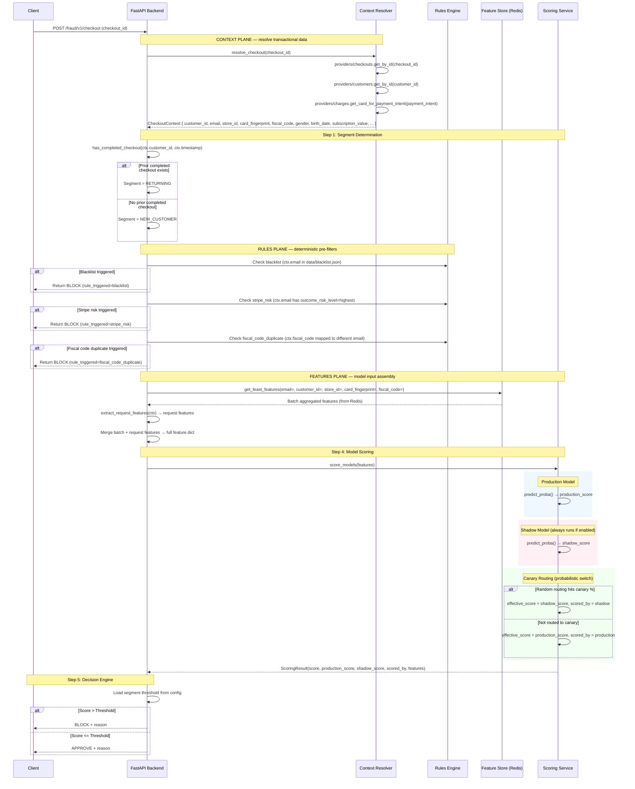
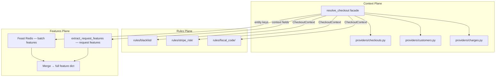
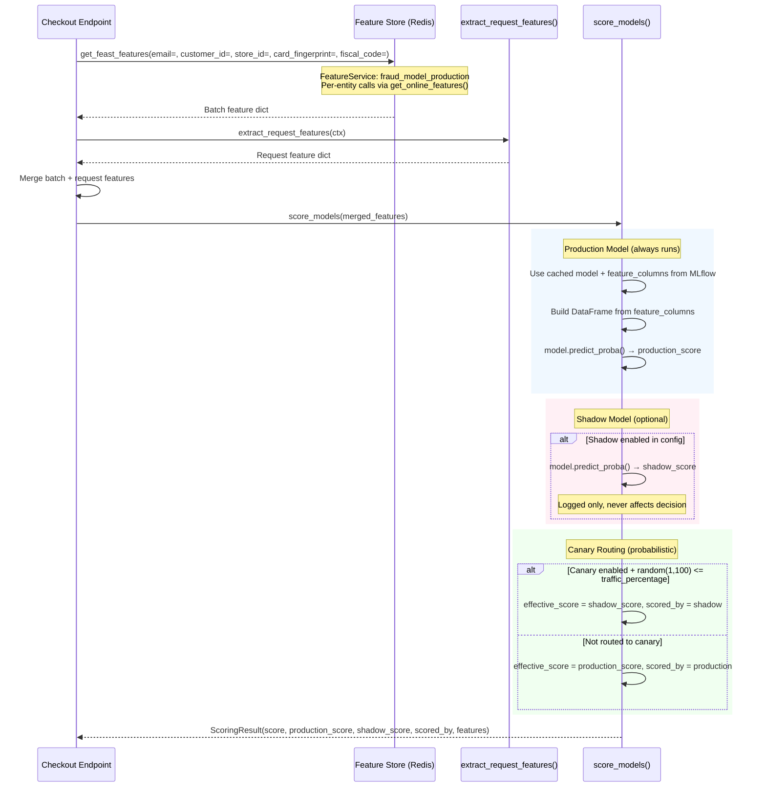
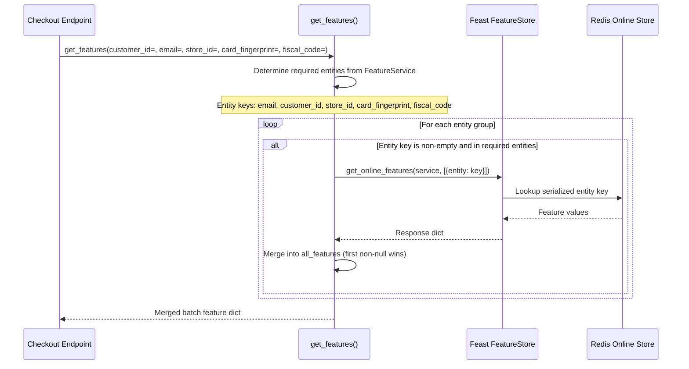
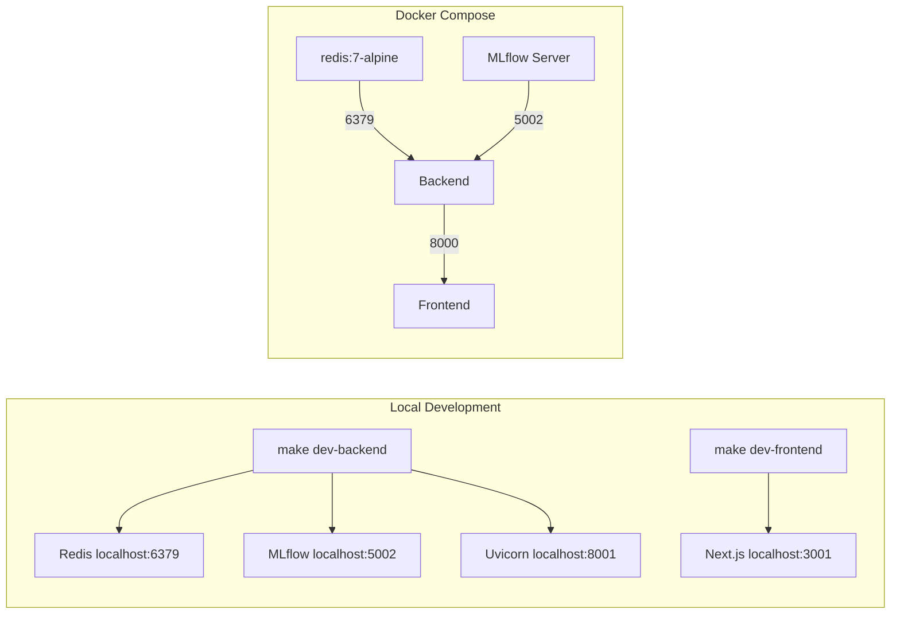

# Subbyx - Fraud Detection System

A real-time fraud detection system for checkout transactions.


## Quick Start

This example of repositori can be used as a template for building a fraud detection system, special Make commands are used to run the system locally.
The system is composed of 3 services: backend, frontend and pipeline.

Pipeline is a sequence of step to clean and present a flow of 2 models with arbitrary features in pseudo feature store ( local data offline store + redis online store + feast)

Frontend is a rudimental UI admin tool to simulate potential processes of a real fraud detection system.

Backend is a FastAPI fraud detection API that serves data, call feature store and call models.

Additional service like Redis,MLFLOW,FEAST are running in the background

The process is not meant to be used as is, rather as an example of how a fraud detection system can be grow and evolve.

### Local Development

Might have issues with network with compose up, if so use the following commands:

```bash
# Terminal 1: Start backend + MLflow
make dev-backend

# Terminal 2: Start frontend
make dev-frontend

# Terminal 3: Start pipeline with logs
make pipeline-logs
```

## Services

| Service | Port (Docker) | Port (Local) | Description |
|---------|---------------|--------------|-------------|
| Frontend | 3001 | 3001 | Next.js prediction UI |
| Backend | 8001 | 8001 | FastAPI fraud detection API |
| Redis | 6379 | - | Feature store online store |
| MLflow | 5002 | 5002 | Model tracking |


## System Architecture


# Request Sequence Diagrams (Three-Plane Architecture)

This document contains sequence diagrams showing the request flows for the Subbyx fraud detection system after the context resolver + feature plane redesign.

---

## Real-Time Checkout Flow

The primary flow when a checkout request comes in for fraud prediction.



---

## API Endpoints

| Method | Path | Purpose |
|--------|------|---------|
| POST | `/fraud/v1/checkout` | Main fraud detection endpoint (accepts checkout_id) |
| POST | `/fraud/v1/segment/determine` | Standalone segment determination |
| POST | `/fraud/v1/features/get` | Standalone feature fetching |
| POST | `/fraud/v1/rules/blacklist/check` | Standalone blacklist check |
| POST | `/fraud/v1/rules/stripe_risk/check` | Standalone Stripe risk check |
| POST | `/fraud/v1/rules/fiscal_code/check` | Standalone fiscal code duplicate check |
| GET | `/fraud/v1/checkouts` | Browse historical checkouts with filters and pagination |

---

## Three Data Planes



Each plane has its own data sources that can evolve independently:

| Plane | Responsibility | Today's source | Tomorrow's source |
|-------|---------------|----------------|-------------------|
| **Context** | Entity resolution + request fields | CSV (`@lru_cache`) | Application DB / API |
| **Rules** | Deterministic blockers | JSON + CSV | Rules engine DB / Redis sets |
| **Features** | Model input (batch + request) | Feast Redis + context fields | Feast Redis + context fields |

---

## Rules Engine

The rules engine runs before the model as a deterministic pre-filter. Rules are independent checks that can block requests immediately without calling the ML model.

### Current Rules

| Rule | Description | Data Source |
|------|-------------|-------------|
| `blacklist` | Block exact email matches | `data/blacklist.json` |
| `stripe_risk` | Block if email has historical charge with highest risk level | `data/01-clean/charges.csv` |
| `fiscal_code_duplicate` | Block if fiscal code is mapped to a different email | `data/01-clean/customers.csv` |

### Rule Priority

Rules run in order, first match wins:

1. **blacklist** - Block known bad emails (loaded once, cached via `@lru_cache`)
2. **stripe_risk** - Block emails with Stripe Radar highest risk (`outcome_risk_level == "highest"`, cached via `@lru_cache`)
3. **fiscal_code_duplicate** - Block fiscal codes used with different emails (PIT-filtered, cached via `@lru_cache`)
4. **model** - ML model decision (last line of defense)

### Adding New Rules

To add a new rule:

1. Create rule file in `routes/fraud/rules/{rule_name}/`
2. Implement check function with its own data loading
3. Add rule check in `checkout.py` after existing rules
4. Update this documentation

---

## Component Detail: Scoring Pipeline

Detailed view of how scoring works across production, shadow, and canary models.



---

## Feature Fetching

Features are fetched from Redis via Feast's FeatureService abstraction. All entity keys come from the resolved `CheckoutContext`.



---

## Feature Services

| Service | Contents | Used by |
|---------|----------|---------|
| `train_model_service` | `ALL_VIEWS` (all candidate features) | `create_training_data.py` via `get_historical_features()` |
| `fraud_model_production` | `_select_from_views(PRODUCTION_FEATURES)` | Online serving (production model) |
| `fraud_model_shadow` | `_select_from_views(SHADOW_FEATURES)` | Online serving (shadow model) |

---

## Train/Serve Parity

The **MLflow `feature_columns` param** is the contract between training and serving:

- **Training**: model trained on `[batch_features + request_features]`, `feature_columns` logged to MLflow
- **Serving**: `Model.predict()` reads `feature_columns` from MLflow, builds DataFrame from the merged dict
- **Missing features** → `np.nan` → handled by the sklearn Pipeline's `SimpleImputer`

Request feature transforms are centralized in `services/fraud/features/request_features.py`, imported by both training and serving code.

---

## Decision Thresholds

| Segment | Threshold | Description |
|---------|-----------|-------------|
| NEW_CUSTOMER | X | First-time customers, very strict |
| RETURNING | Y | Returning customers, more lenient |

Decision: `score > threshold` → BLOCK, otherwise → APPROVE

---

## Infrastructure



| Component | Local | Docker Compose |
|-----------|-------|----------------|
| Redis | `localhost:6379` (via `make redis`) | `redis:6379` (`FEAST_REDIS_HOST`) |
| MLflow | `http://localhost:5002` | `http://mlflow:5000` |
| Backend | `http://localhost:8001` | `http://backend:8000` |
| Frontend | `http://localhost:3001` | `http://frontend:3000` |
| Feast Registry | `data/feast/registry.db` (SQLite) | Same (copied into image) |
| Feast Online Store | Redis | Redis |

---

## Configuration Sources

| Config File | Location | Purpose |
|-------------|----------|---------|
| `config.yaml` | `routes/fraud/config.yaml` | Segment thresholds, segment keys |
| `config.yaml` | `services/fraud/inference/config.yaml` | MLflow URIs, shadow/canary settings |
| `shared.yaml` | `routes/config/shared.yaml` | Decision labels, data paths |
| `feature_store.yaml` | `feature_repo/feature_store.yaml` | Feast config (Redis online store) |

---

## Key Design Decisions

| Aspect | Detail |
|--------|--------|
| **Three data planes** | Context (entity resolution), Rules (deterministic blocks), Features (model input). Each plane has independent, swappable data sources. |
| **Context resolver** | Facade pattern: `resolve_checkout(checkout_id)` delegates to single-responsibility providers (checkouts, customers, charges). Client sends only `checkout_id`. |
| **Online store** | Redis (`$FEAST_REDIS_HOST`, defaults to `localhost:6379`). Materialized via `make feast-restart`. |
| **Feature fetching** | FeatureService via `get_online_features()`. Multi-entity lookup (email, customer_id, store_id, card_fingerprint, fiscal_code) merged into one dict. |
| **Two feature types** | Batch features from Feast (pre-computed aggregates) + request features from CheckoutContext (transactional fields). Merged before scoring. |
| **Per-model features** | Each model's feature list logged to MLflow as `feature_columns` param at training time. Inference reads from model metadata. |
| **Model artifact** | sklearn Pipeline with imputer + calibrated LightGBM classifier. Imputation and calibration bundled — no train/serve skew. |
| **Missing values** | Missing features passed as `NaN`. Pipeline's imputer step handles per-feature imputation. |
| **Model caching** | Models loaded lazily on first request, cached in memory. No MLflow calls per prediction. |
| **Shadow scoring** | Always runs if enabled; score logged but never used for decisions. |
| **Canary scoring** | Random routing (`traffic_percentage`% of requests via shadow model). Score used for decision when active. |
| **Segment determination** | Customer checkout history check: `has_completed_checkout(customer_id, timestamp)` — PIT-correct lookup in checkouts data. |
| **Two-stage decision** | Rules engine (instant deterministic blocks) before ML model (score-based threshold). |
| **Rules** | File-based, `@lru_cache`-backed. Each rule in `routes/fraud/rules/{rule_name}/` with its own data source. |
| **Threshold optimization** | Per-segment thresholds in `routes/fraud/config.yaml`. NEW_CUSTOMER=x, RETURNING=y |


# Subbyx Fraud Detection - Model Performance Report


**Model Name:** `fraud-detector`  
**Framework:** LightGBM + Feast + MLflow

## 1. Executive Summary
The latest training pipeline successfully processed 5,005 samples, resulting in a production-ready model and a shadow model. 


## 2. Production Model (@production)
*   **Feature Count:** 27
*   **Training Set:** 2,245 samples (17.3% fraud)
*   **Test Set:** 814 samples (12.0% fraud)

### Performance Metrics
| Metric | Validation | Test |
| :--- | :--- | :--- |
| **AUC-PR** | 0.8476 | 0.6072 |
| **ROC-AUC** | 0.9264 | 0.8944 |

---

## 3. Shadow Model (@shadow)
*   **Feature Count:** 8 (Lightweight)
*   **Goal:** Provide a stable baseline with minimal feature dependencies.

### Performance Metrics
| Metric | Validation | Test |
| :--- | :--- | :--- |
| **AUC-PR** | 0.6732 | 0.2518 |
| **ROC-AUC** | 0.7153 | 0.7422 |

---


Rule Performance Evaluation (on Test Set)
================================================================================
                     Rule   Triggered Precision Recall ROC AUC PR AUC
                Blacklist    0 (0.0%)     0.000  0.000   0.500  0.120
Stripe Risk (Score >= 90)    0 (0.0%)     0.000  0.000   0.500  0.120
    Fiscal Code Duplicate  97 (11.9%)     0.041  0.041   0.455  0.117
Payment Failure (Updated)   49 (6.0%)     0.469  0.235   0.599  0.202
       Rules Engine (ALL) 146 (17.9%)     0.185  0.276   0.555  0.138
================================================================================
Note: Stripe Risk is evaluated using a score threshold proxy (>= 90).
Note: Fiscal Code Duplicate uses the n_emails_per_fiscal_code feature.